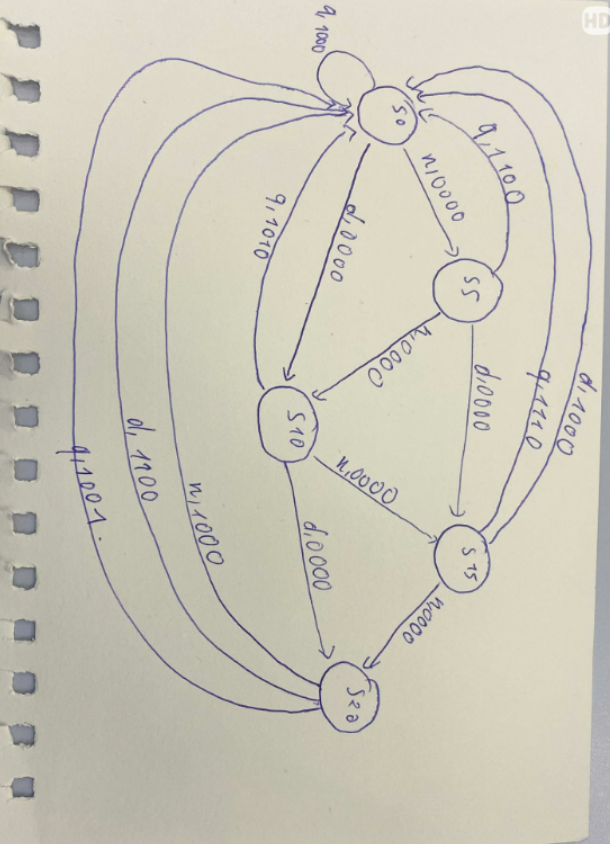
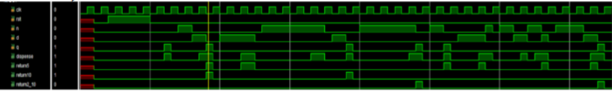

# Finite State Machine (FSM) — Soda Dispenser Controller

A Verilog implementation of a Mealy Finite State Machine (FSM) controlling a subsidized soda vending machine. The design accepts nickels (5¢), dimes (10¢), and quarters (25¢), dispenses soda when the accumulated sum reaches 25¢, and calculates exact change.

Target Board: **Xilinx ZCU104** | Tool: **Vivado 2022.1** | Language: **Verilog**

---

## 1. Specifications & Architecture
* **Dispense Threshold:** 25 cents.
* **Inputs:** `clk`, `rst` (active-high synchronous), `n` (5¢), `d` (10¢), `q` (25¢).
* **Outputs (Mealy Type):** `dispense`, `return5`, `return10`, `return2_10`.
* **State Definition:** 5 distinct states (`S0`: 0¢, `S5`: 5¢, `S10`: 10¢, `S15`: 15¢, `S20`: 20¢). When accumulated funds exceed 25¢, the system dispenses, returns change, and transitions back to `S0` within the same cycle.

### State Transition Diagram

---

## 2. RTL Implementation
The design follows the standard **3-block coding style** in `rtl/sodaDispenser.v`:
1. **Sequential Block:** Clocked state register updating on `posedge clk` with synchronous reset.
2. **Combinational Next-State Logic:** Evaluates current state and coin inputs to determine `state_next`. Includes a `default` case to strictly prevent accidental latch inference.
3. **Combinational Output Logic:** Mealy-style outputs derived from both current state and input pulses.

---

## 3. Verification & Simulation
Verified using a self-checking testbench (`tb/tb_sodaDispenser.v`) running at a 100 MHz clock period (10 ns). Stimuli are applied on `negedge clk` to maintain robust setup/hold margins before clock sampling.

* Passed all 10 corner test scenarios (exact payments, accumulation, various change permutations).

---

## 4. Synthesis & Encoding Comparison
Static Timing Analysis (STA) was performed targeting a 100 MHz system clock constraint (`constr/timing.xdc`). The FSM state register was synthesized under 4 encoding strategies using the `(* fsm_encoding = "..." *)` attribute:

| Encoding Strategy | CLB LUTs | CLB FFs | WNS (ns) | Max Freq ($F_{max}$) |
| :--- | :---: | :---: | :---: | :---: |
| `user_encoding` (Binary) | 7 | 3 | 9.434 | ~1.76 GHz |
| `gray` | 7 | 3 | 9.434 | ~1.76 GHz |
| `auto` | 7 | 3 | 9.434 | ~1.76 GHz |
| `one_hot` | 8 | 5 | 9.434 | ~1.76 GHz |

**Trade-off Analysis:**
* **Binary / Gray:** Uses minimum flip-flops ($\lceil \log_2(5) \rceil = 3$ FFs).
* **One-Hot:** Uses 1 FF per state (5 FFs) with slightly higher LUT count in this minimal circuit. In larger designs, one-hot reduces decode logic depth, making it ideal for FPGA architectures with abundant register resources.
